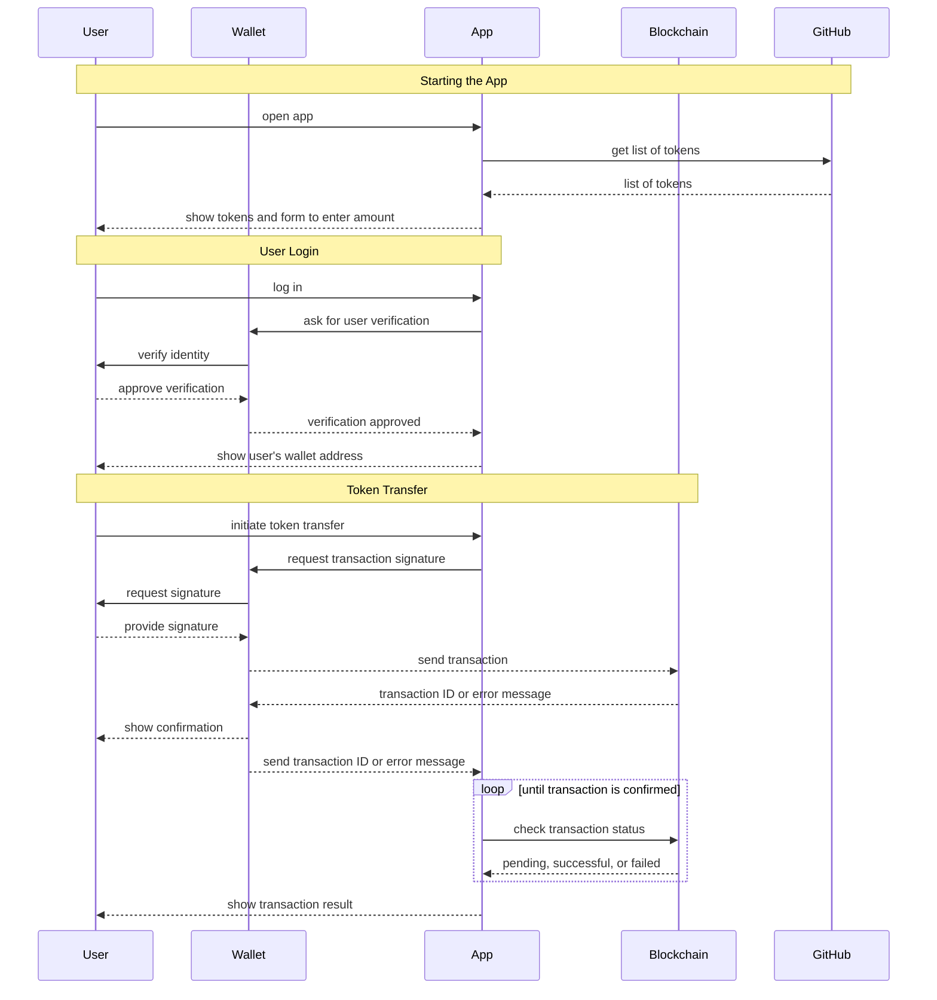

# Buy me a Coffee

This demo project serves as an example for building a basic dApp for VeChain using dApp-Kit.

It uses as few dependencies as possible, but includes:

- TypeScript to enhance stability and safety for developers
- tailwindcss, @headlessui/react, @heroicons/react to improve the UI from an interface perspective
- @tanstack/react-query to simplified web requests

The project demonstrates the following functionalities:

- Signing in with VeChain Certificates
- Building & Sending Transactions
- Tracking Transaction Status

Start playing with the project immediately with the following steps:

```shell
git clone https://github.com/ifavo/example-buy-me-a-coffee.git
cd example-buy-me-a-coffee
npm install
npm start
```

## Scripts

### Run

- Execute `npm start` to run the project.
- The app can be accessed at http://localhost:1234/

### Build

- To build the website, execute `npm run build`.
- The generated output will be located in the `dist/` directory.

## Application Process

The application prompts the user to sign in using their wallet. It retrieves a list of available tokens from a public GitHub repository, enabling the user to send either VET or a selected token to a specified address. The status of the transaction is monitored and displayed.



## Application Structure

At the center is the `<App />` component, which is responsible for rendering both the layout and the application itself. This component is encapsulated by providers designed to establish global connectivity for VeChain and HTTP requests.

```
+---------------------- React -------------------------+
|                                                      |
|  +------------- QueryClientProvider ---------------+ |
|  |  by @tanstack/react-query to support useQuery() | |
|  |                                                 | |
|  |  +--------- DAppKitProvider ----------+         | |
|  |  |  @vechain/dapp-kit to enable hooks |         | |
|  |  |                   and connectivity |         | |
|  |  |                                    |         | |
|  |  |               <App />              |         | |
|  |  +------------------------------------+         | |
|  +-------------------------------------------------+ |
+------------------------------------------------------+

```

**Files & Folders:**

```
src
├── App.tsx (Providers and global setup)
├── BuyCoffee (Buy-me-a-Coffee component)
├── Layout
├── common
├── config (configuration settings)
├── index.css
├── index.html
└── index.tsx
```

